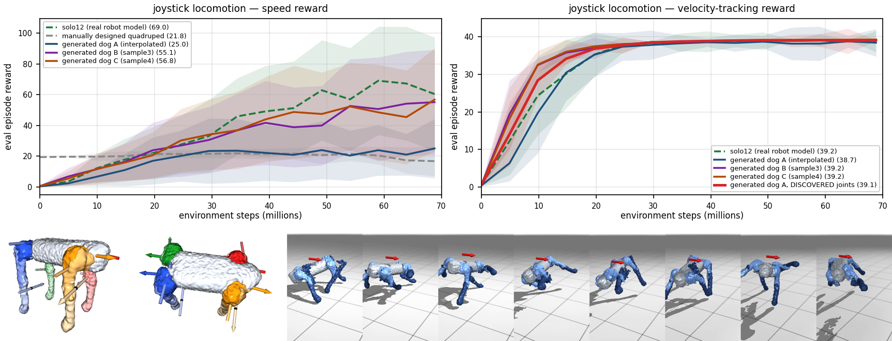

# ArticFlow: Action-Conditioned Flow Matching for Skeleton-Free Articulated Generation

**CoRL 2026** · Jiong Lin, Jinchen Ruan, Hod Lipson (Columbia University)

[Project page](https://jl6017.github.io/ArticFlow/) · [OpenReview](https://openreview.net/forum?id=xXnpKl2IgD)

ArticFlow generates articulated 3D objects — pliers, scissors, eyeglasses, robot arms,
quadrupeds — as deformable point clouds under explicit action control, **without a
kinematic skeleton as input**. It couples (i) a latent flow that samples a shape-prior
code and (ii) an action-conditioned point flow that transports noise to the posed shape.
One model per category spans shapes and actions, supports interpolation in both, and
its outputs chain into a point-cloud-to-URDF pipeline for simulation and policy training.

<p align="center"></p>

## Install

```bash
conda create -n articflow python=3.12 -y
conda activate articflow
pip install torch --index-url https://download.pytorch.org/whl/cu126   # match your CUDA
pip install -r requirements.txt
```

The PVCNN voxelization ops and EMD/Chamfer metrics JIT-compile on first use
(`ninja` + a CUDA toolchain matching your torch build are required; set
`TORCH_CUDA_ARCH_LIST` for your GPU, e.g. `"12.0"` for RTX 5090).

## Data

Datasets are built from [PartNet-Mobility](https://sapien.ucsd.edu/browse) (pliers,
scissors, eyeglasses) and [MuJoCo Menagerie](https://github.com/google-deepmind/mujoco_menagerie)
(arms, quadrupeds). `dataset/datamaker/` contains the generation code: URDF/MJCF instances
are swept through per-joint action sequences and rendered to point-cloud H5 shards
(`data_norm`, per-instance normalized actions). See `dataset/make_partnet_dataset.py`.

## Train

One model per category. The paper recipe (hybrid PVCNN backbone, adversarial latent):

```bash
python -u train.py --dataset_type partnet_h5 --data_dir <category_h5_dir> \
  --out_dir runs/<category> --epochs 2000 --batch_size 16 --amp --use_bf16 \
  --use_cosine_lr --seed 123 --pf_backbone hybrid --pf_width 512 --pf_depth 6 \
  --pf_emb_dim 256 --latent_dim 128 --enc_width 128 --enc_depth 4 \
  --ctx_dim 16 --ctx_emb_dim 256 --ctx_stage_channels 80 112 112 \
  --ctx_stage_blocks 2 2 2 --ctx_stage_res 24 16 8 --ctx_with_se --ctx_with_global \
  --ctx_voxel_normalize --ctx_t_gate_k 12.0 --ctx_t_gate_tau 0.97 \
  --pointflow_rgb --tr_max_sample_points 20000 --te_max_sample_points 4096 \
  --lr_pf 2e-4 --lr_lf 2e-4 --lr_enc 2e-4 --min_lr 1e-6 --warmup_steps 1000 \
  --weight_decay 1e-4 --grad_clip_norm 1.0 --ema_decay 0.9995 --ema_eval
```

## Sample

`demo.py` samples a (shape × action) grid from the prior — no dataset needed:

```bash
python -u demo.py --ckpt checkpoints/<category>_all_hybrid_11_12_uncond_adv.pt \
  --out_dir demo_out --latent_mids 5 --joint_mids 10 --n_points 20000 --steps 200
```

Rows sweep the action, columns interpolate the shape latent (SLERP); frames are written
as PLY sequences plus rendered grids. Checkpoints for the five categories will be
attached as a GitHub Release.

## Evaluation

`metrics/evaluation_metrics.py` implements CD/EMD, MMD, COV, and 1-NNA (the paper's
generation metrics). The kinematic-consistency probes and simulation-readiness
evaluation added for the CoRL rebuttal live in `eval/` (see `eval/README.md`).

## URDF / simulation pipeline

Generated point-cloud sweeps can be reconstructed into URDF/MJCF robots and trained
with RL. We document the procedure and its (mixed) results in
[`docs/ARTICFLOW_TO_URDF.md`](docs/ARTICFLOW_TO_URDF.md) — the reconstruction code
itself is [AutoURDF](https://github.com/jl6017/AutoURDF) and is not vendored here.

## Citation

```bibtex
@inproceedings{lin2026articflow,
  title     = {ArticFlow: Action-Conditioned Flow Matching for Skeleton-Free Articulated Generation},
  author    = {Lin, Jiong and Ruan, Jinchen and Lipson, Hod},
  booktitle = {Conference on Robot Learning (CoRL)},
  year      = {2026}
}
```

## Acknowledgments

`third_party/` vendors [PVCNN](https://github.com/mit-han-lab/pvcnn),
[PyTorchEMD](https://github.com/daerduoCarey/PyTorchEMD), and
[ChamferDistancePytorch](https://github.com/ThibaultGROUEIX/ChamferDistancePytorch)
under their respective licenses.
