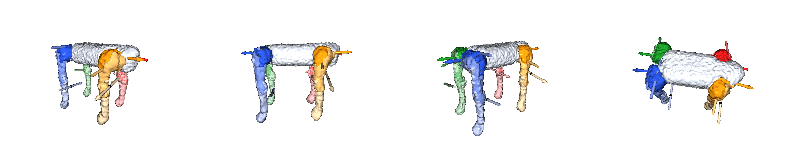
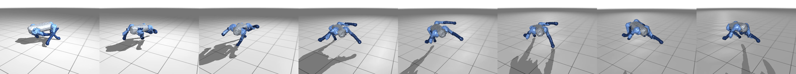

# From generated point clouds to URDF/MJCF robots

ArticFlow outputs are point-cloud *sweeps* (the same shape latent posed under a
per-joint action ramp). That is exactly the input registration-based articulated
reconstruction needs, so generated objects can be turned into simulable robots.
This page documents the procedure and shows representative results. **The
reconstruction code is [AutoURDF](https://github.com/jl6017/AutoURDF) and is not
vendored in this repository** — only the interface is described here.

## Procedure

1. **Generate sweeps** — `demo.py --joint_mids 10` (12+ frames per joint; the
   registration needs ≥10 frames). One sweep per action dimension, one dimension
   moving at a time, holding the shape latent fixed.
2. **Safe rotation directions** — generated surfaces merge on contact ("watery"
   point clouds): when two limbs touch, points fuse and segmentation degrades.
   Sweep each joint in its collision-free (outward) direction only; probe both
   signs and keep the direction whose sweep stays clear.
3. **Bridge** — convert ASCII PLY sweeps to AutoURDF's raw layout (binary PLY,
   downsampled, with a `joint_cfg.txt` per frame).
4. **AutoURDF** — cluster registration → coordinate mapping → URDF emission,
   run per joint (`dof=1`) with masks handed down the kinematic tree
   (body → upper leg → lower leg for a quadruped).
5. **Validate per sample** — always load-check the URDF/MJCF (pybullet or
   MuJoCo). Validity is per-sample: an occasional sample registers into a cyclic
   tree and is rejected; pick another latent column on failure.

## Results (honest summary)

Reconstruction quality is **mixed** — good enough to train locomotion policies,
not good enough to call solved:

- On a generated (latent-interpolated) quadruped, full 12-joint discovery reaches
  a **median joint-direction error of ~10°** against canonical category axes,
  with per-joint errors from 2° to ~29°; the worst joints sit on limbs whose
  point clouds fuse with the trunk at contact.
- All 13 quadrupeds of one batch assembled into MJCF robots that load and step
  in MuJoCo/MJX with 12 actuators; mass and scale are calibrated (not generated),
  and robot self-collision is disabled.
- Policies trained on the reconstructed robots reach 80–82% of a real robot
  model's best speed-objective reward, and match it within evaluation noise on
  a velocity-tracking objective — including a robot assembled entirely from
  *discovered* joints.
- Joint **positions** have no ground truth on generated morphologies, and joint
  **directions** admit a reference only where the training set shares aligned
  canonical axes (the quadruped category); treat the numbers above accordingly.

Discovered kinematics on a generated quadruped (per-link segmentation, twelve
recovered joints, arrows = collision-free rotation direction):

The same robot walking under a trained policy, rendered with its generated meshes:

